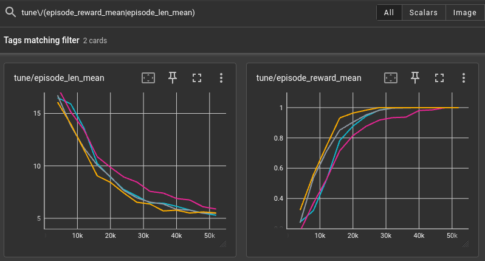
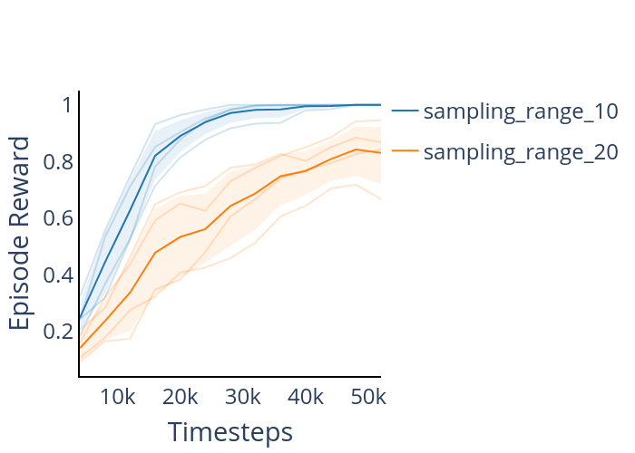

# rlgear-starter

Example starter project for using [rlgear](https://github.com/esquires/rlgear)

## Installation

```bash
# after cloning make sure the submodules are available
git submodule update --init

conda create -n rlgear-starter python=3.10
conda activate rlgear-starter

# install pytorch: https://pytorch.org/get-started/locally/
# an example for a cpu-only install is the following line
conda install pytorch torchvision torchaudio cpuonly -c pytorch

pip install -e submodules/rlgear
pip install -e .
```
## Usage

This repo contains a simple environment
(see [envs.py](./rlgear_starter/envs.py))
where an agent is spawned along a line
within a sample range (the default is between -10 and 10). It has a discrete
action space of 0 (move 1 unit down), 1 (do not move), and 2 (move up). To
train an RL system run the following:

```bash
cd scripts
python run_rlgear_starter.py rlgear_starter.yaml sampling_range_10
```

`rlgear` will create a symlink for you to the latest log directory
(as well as print the log directory to the terminal). Under that directory you
can find the normal ray logging as well as a `meta` directory containing
everything needed to create the experiment (see the `README.md` in the `meta`
directory)

To view the results, run the following in another terminal.
It should show 4 experiments
(see `num_samples` in `rlgear_starter.yaml`) that get a reward of 1 (the max reward)
in about 30k steps. 

```bash
# this regex filter will be useful "tune\/(episode_reward_mean|episode_len_mean)"
tensorboard --logdir ~/ray/rlgear_starter/rlgear_starter/test
```

It should look something like this:



Sometimes it is helpful to plot a lot of different experiments at once. For
example, you might run 5 experiments each with 4 repeats. This gets a bit
difficult to interpret in tensorboard so rlgear provides a plotting utility
to find and group the experiments for you. As an example, to see whether the
sampling range of the environment has an effect on training, you can go into
`rlgear_starter.yaml` and set `sampling_range = [-20, 20]` and then run


```bash
python run_rlgear_starter.py rlgear_starter.yaml sampling_range_20
```

You can plot it (if the experiment has not finished it will plot partial
results). This will result in 2 plotly plots, one for reward and one for
episode length:

```bash
python plot_rlgear_starter.py
```

The result should look something like this:



